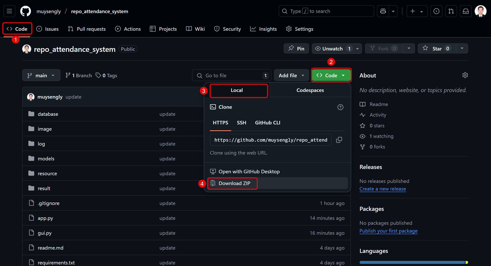
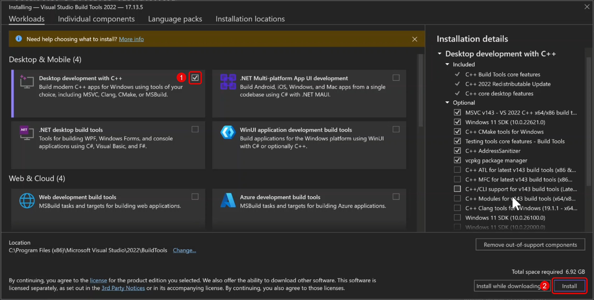
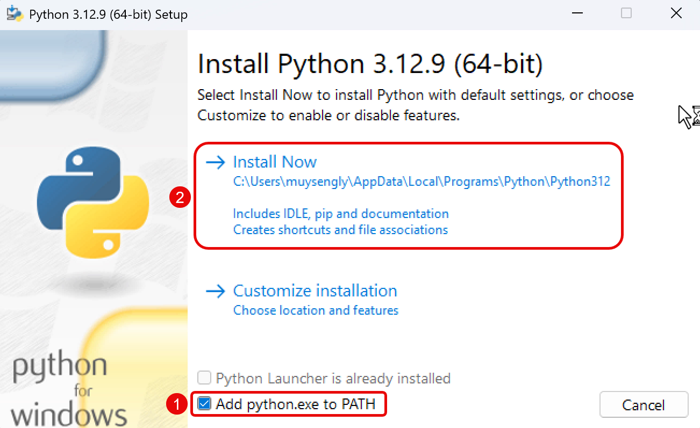

# Attendance System Using Face Recognition

- Developer: MUY SENGLY
- Telegram: https://t.me/muysengly

# How To Setup?

---

## Step 1: Download Project

### 1.1. Download The Repository

- **Link**: https://github.com/muysengly/proj_attendance

### 1.2. Unzip The Downloaded File.

- **Recommended**: Unzip the file to `Desktop`.

---

## Step 2: Download And Install Visual Studio Build Tools

### 2.1. Download Visual Studio Build Tools

- **Link**: https://aka.ms/vs/17/release/vs_BuildTools.exe

### 2.2. Install Visual Studio Build Tools with C++ Build Tools

---

## Step 3: Download And Install Python 3.11

### 3.1. Download Python 3.11

- **Link**: https://www.python.org/ftp/python/

### 3.2. Install Python 3.11

---

## Step 4: Setup Project

### 4.1. Run Bat File To Install Required Libraries

- **Run**: `setup.bat`

**NOTE**: if you have problem with `setup.bat`, please contact me

---

## Step 5: Run Application

### 5.1. Run Application

- **Run**: `runs.vbs`
